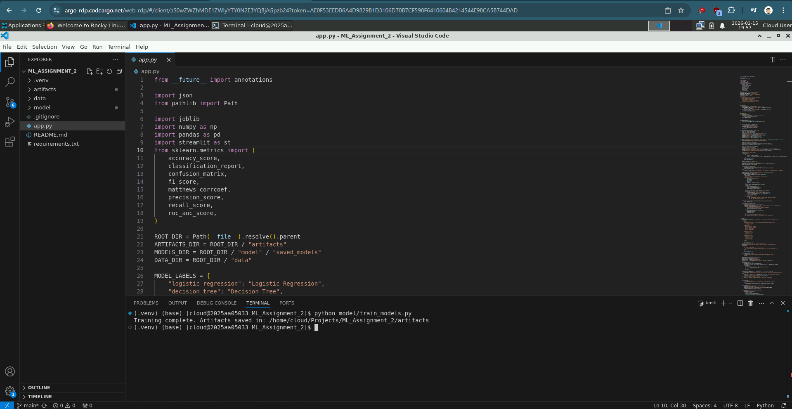
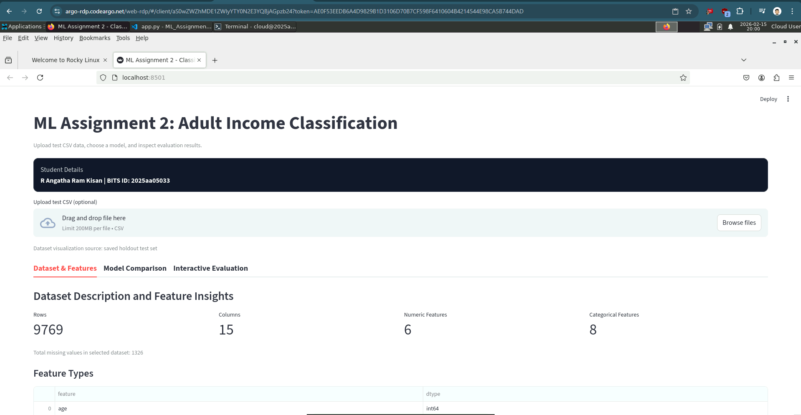
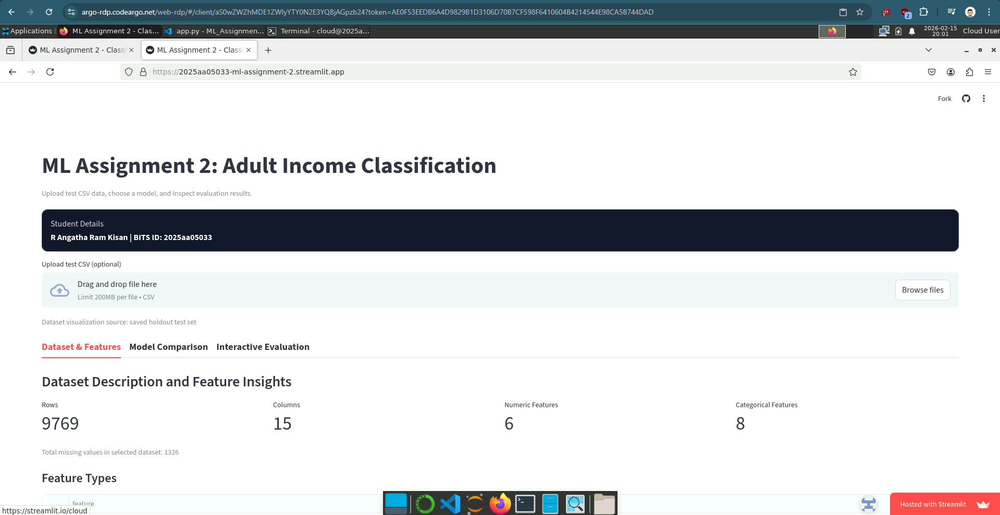

# Machine Learning Assignment 2 Submission Report

**Student Name:** `R Angatha Ram Kisan`  
**BITS ID:** `2025aa05033`

## 1) GitHub Repository Link

Repository URL: `https://github.com/2025aa05033/ML_Assignment_2`

Repository includes:
- Complete source code
- `requirements.txt`
- `README.md`

## 2) Live Streamlit App Link

App URL: `https://2025aa05033-ml-assignment-2.streamlit.app/`

## 3) Screenshot (BITS Virtual Lab Execution Proof)

## 4) README Content

### a) Problem Statement
Build an end-to-end machine learning classification project on one public dataset and implement 6 required models on the same train/test split:

1. Logistic Regression
2. Decision Tree Classifier
3. K-Nearest Neighbor Classifier
4. Naive Bayes Classifier (Gaussian)
5. Random Forest (Ensemble)
6. XGBoost (Ensemble)

Then create an interactive Streamlit app with CSV upload, model selection, metric display, and confusion matrix / classification report.

### b) Dataset Description
- **Dataset:** UCI Adult Income dataset (fetched via OpenML: `adult`, version `2`)
- **Task type:** Binary classification (`<=50K` vs `>50K`)
- **Instances:** 48,842
- **Features:** 14 total (mixed numeric + categorical), satisfying assignment minimum of 12 features
- **Target column:** `class` (mapped to `0` for `<=50K`, `1` for `>50K`)
- **Split strategy:** Stratified train/test split (`80/20`, `random_state=42`)

### c) Models Used and Metrics

#### Comparison Table

| ML Model Name | Accuracy | AUC | Precision | Recall | F1 | MCC |
|---|---:|---:|---:|---:|---:|---:|
| Logistic Regression | 0.8524 | 0.9042 | 0.7414 | 0.5885 | 0.6562 | 0.5699 |
| Decision Tree | 0.8169 | 0.7490 | 0.6171 | 0.6189 | 0.6180 | 0.4976 |
| kNN | 0.8384 | 0.8699 | 0.6827 | 0.6065 | 0.6424 | 0.5400 |
| Naive Bayes (Gaussian) | 0.6204 | 0.8287 | 0.3794 | 0.9213 | 0.5374 | 0.3866 |
| Random Forest (Ensemble) | 0.8644 | 0.9163 | 0.7953 | 0.5834 | 0.6731 | 0.6013 |
| XGBoost (Ensemble) | 0.8726 | 0.9272 | 0.7943 | 0.6309 | 0.7032 | 0.6301 |

#### Observations on Model Performance

| ML Model Name | Observation about model performance |
|---|---|
| Logistic Regression | Strong baseline with balanced performance; lower recall than ensembles but stable and interpretable. |
| Decision Tree | Captures nonlinearity but overfits relative to ensembles, giving lower AUC and MCC. |
| kNN | Better than single tree on this dataset, but performance is sensitive to distance behavior in high-dimensional encoded space. |
| Naive Bayes (Gaussian) | Very high recall but poor precision, producing many false positives and weaker overall balance. |
| Random Forest (Ensemble) | Better precision and MCC than single-tree models with reduced model size after optimization. |
| XGBoost (Ensemble) | Best overall model across key ranking metrics, with strong balance after size optimization. |

---